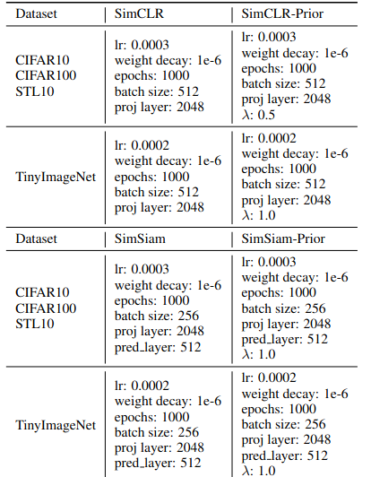

This is the official code for TMLR paper, **"[Can We Break Free from Strong Data Augmentations in Self-Supervised Learning?
](https://arxiv.org/abs/2404.09752)"** by Shruthi Gowda, Elahe Arani and Bahram Zonooz.

## Methodology

Schematic of SSL method with Prior knowledge integration. The SSL module can incorporate any SSL
method, such as Contrastive, Asymmetric, and Feature Decorrelation-based, and one method is selected from each
category for this study. The prior network extracts implicit semantic knowledge and supervises the SSL module net-
work to learn better representations. The resulting network from the SSL module is then used for inference purposes.
This approach is expected to improve the quality of learned features and enhance the generalization capability of the
resulting network

[//]: # (![image info]&#40;./src/ssl.png&#41;)

## Requirements
- python==3.8.0
- torch==1.10.0
- torchvision==0.8.0 

## Setup

Hyper-parameters for different SSL techniques and datasets -
[//]: # (![image info]&#40;./src/hyper.png&#41;)

## Cite Our Work

## License

This project is licensed under the terms of the MIT license.

